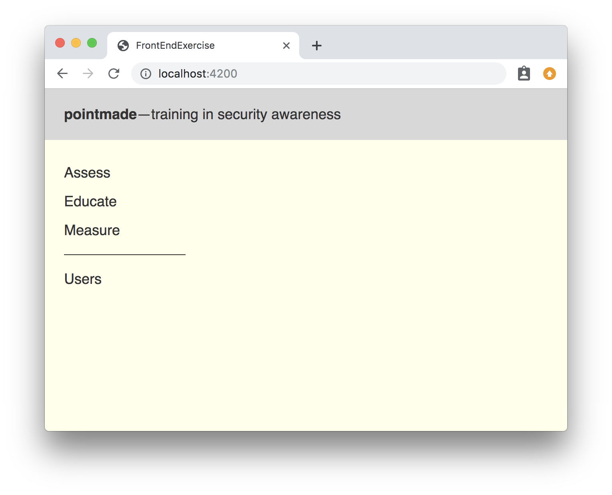

# Pointmade

Thanks for your interest in a front-end role at Proofpoint Security Awareness
Training! This repo contains a toy version, implemented in [Ember
3.8](https://api.emberjs.com/ember/3.8), of our real product. Its purpose is to
help simulate "real work" as much as possible within the constraints of our
interview process. Please
[duplicate](https://help.github.com/en/articles/duplicating-a-repository) this
repo to a :lock: **private** repository, and add the Proofpoint hiring manager
you are communicating with as a collaborator. Then watch for your first
interview task as a GitHub issue.

In the mean time, read on for how to set up the project locally ...

## Setup

### Prerequisites

* [Git](https://git-scm.com/)
* [Node.js](https://nodejs.org/) (with npm)

### Installation

* `git clone git@github.com:{{your-username}}/pointmade.git` &larr; your private repo
* `cd pointmade`
* `npm install`

### Running / Development

* `ember serve`
* Visit your app at [http://localhost:4200](http://localhost:4200).
* Visit your tests at [http://localhost:4200/tests](http://localhost:4200/tests).

### Running Tests

* `ember test`
* `ember test --server`

### Success

# Legal

Ember's scaffolding is used under [the MIT
license](https://github.com/emberjs/ember.js/blob/v3.8.1/LICENSE).

The remainder is copyright &copy; Proofpoint, Inc. All rights reserved.
